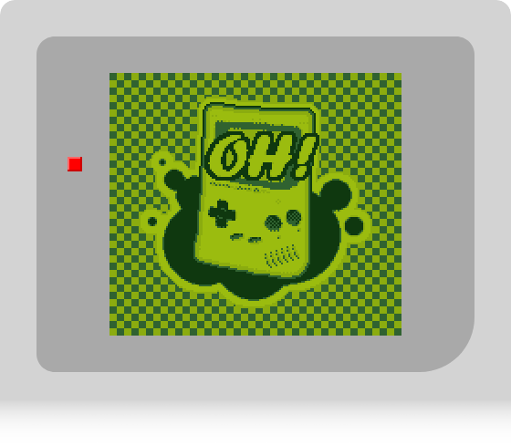

*gemi* is just another GameBoy emulator written in Rust.

Started as a learning project to get familiar with the Rust programming language,
this project evolved into a feature rich emulator with an already good accuracy.

It is still in active development aiming to support more features of the original 
hardware and to improve the accuracy to be able to play the most popular games.

Check out the online demo and feel free to make suggestions about missing features 
or games which are not supported properly.


[](https://christianfischer.github.io/gemi-web/)


### Feature List

| Feature                      | Status                                                                                  |
|:-----------------------------|:----------------------------------------------------------------------------------------|
| Sound                        | ✔️                                                                                      |
| Memory Bank Controller       | ✔️ MBC 1, ✔️ MBC 2, ❌ MBC 3, ✔️ MBC 5                                                   |
| Persistent Cartridge Memory  | ✔️ Supports saving and loading the cartridge RAM, if the cartridge has battery support. |
| Save/Load emulator snapshots | ❌                                                                                       |
| Serial Port / Multiplayer    | ❌ Partially to receive messages from test ROMs. Multiplayer not planned yet.            |
| GameBoy Color Support        | ✔️ Color support ❌ Double Speed mode                                                    |
| Super GameBoy support        | ❌                                                                                       |

### ToDo

* Improve accuracy, especially within the PPU
* GameBoy Color double speed mode
* Super GameBoy (2) Support
* Support to serialize the entire emulator state to allow snapshots
* Shader support to mimic the original display (LCD effect, transparent shadows)
* Controller / Rumble
* Debugger UI
* Pass more test cases
* Get the core library panic free
* Performance measurement and optimizations


### Features currently not planned <font size="1">(but never say "no")</font>
* Multiplayer via Serial Data port
* Infrared Port
* GameBoy Camera / Printer


### Project structure

* *lib/*
  * *lib/core/* - A library with the emulator's core functionality
    with almost no dependencies. This allows to build any kind of frontend
    around it and as well to run headless test scenarios.
 
* *bin/*
  * *bin/gemi-player* - The default emulator frontend, controlled via commandline
    options and using SDL to play audio and video or handle input.
  * *bin/gemi-debugger* - A simple debugger frontend to observe a game's behaviour
    during execution. This is planned to include viewing the device memory, CPU state
    and PPU/APU data like sprites and tiles.
  * *bin/wasm-player* - A wrapper around the emulator core which provides bindings
    to web assembly to allow to create a web frontend.
 
* *tests/*
  * *tests/shared/* - A shared library providing functionality to automatically
    download test ROMs, building a list of testcases and run each test case
    on a headless emulator instance.
  * *tests/test_suite/* - A collection of unit tests to be run via `cargo test`
    (together with other unit tests). Tests, which are know to fail will be ignored
    for normal test runs so any failing test indicates an issue in the emulator code.
  * *tests/update_test_report/* - A small binary to run all known test ROMs and generate
    a report about their results. This is used to track the emulator's accuracy
    and to find regressions.


### Test ROMs

The emulator is tested against several commonly used test ROMs.
Since the emulator's core functionality is placed into a dedicated library,
this allows to run the emulator headless without a UI and then check for 
any success or failed conditions or compare the display output to a 
reference image.

`update-test-report` will run all known test ROMs on a separate emulator instance
and check whether the test passed or failed and stores the results in the doc folder.

[List of test results](doc/test_report.md)


### Run the emulator

* **Native desktop application**

  To run the emulator as a native desktop application, you need to have
  [Rust](https://www.rust-lang.org/tools/install) installed.

  ```bash
  # Clone the repository
  git clone https://github.com/ChristianFischer/gemi.git
  
  # Run the emulator
  cd gemi
  cargo run --bin gemi --release -- <path-to-rom>
  ```
 
* **Visit the online player**

  The emulator can be played online at [https://christianfischer.github.io/gemi-web/](https://christianfischer.github.io/gemi-web/).
  
  This is a web assembly build of the emulator core, wrapped in a small HTML/JavaScript
  application to provide a UI and to handle audio and video output.

